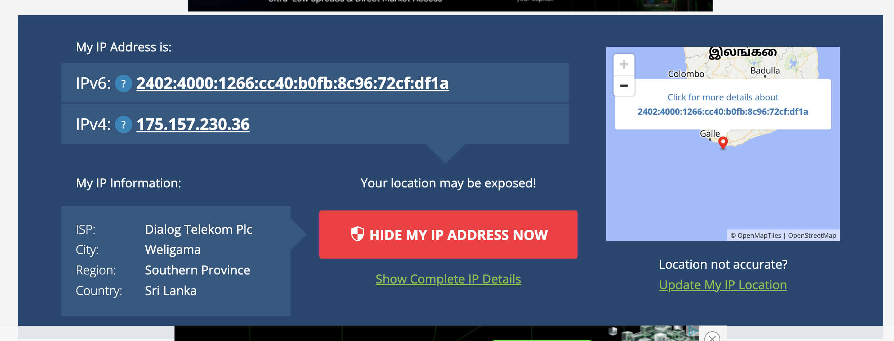

# Nginx Reverse Proxy — Observing Upstream Requests via tcpdump

This document demonstrates how Nginx, acting as a reverse proxy, creates a **second TCP connection** to an upstream service for every incoming client request — and how to observe both connections using `tcpdump`.

---

## Setup

- **Server:** `165.22.245.218` (DigitalOcean droplet)
- **Nginx:** Listening on port `80` (public-facing)
- **Upstream service:** Listening on port `3080` (local)
- **Client:** `175.157.230.36` (Sri Lanka — Dialog Telekom)
- **Endpoint:** `http://165.22.245.218/server`

### Architecture

```
Real Client (175.157.230.36)
        │
        │  HTTP GET /server  (port 80)
        ▼
  Nginx :80  (165.22.245.218)
        │
        │  HTTP GET /server  (port 3080)  ← new TCP connection created by Nginx
        ▼
  Upstream Service :3080  (127.0.0.1)
```

---

## Capturing Traffic

### Step 1 — Run tcpdump on the server

Capture all TCP traffic on both port 80 (client → Nginx) and port 3080 (Nginx → upstream):

```bash
sudo tcpdump -i any -n 'tcp port 80 or tcp port 3080' -w /home/nginx-dump.pcap
```

### Step 2 — Download the capture file

```bash
scp root@165.22.245.218:/home/nginx-dump.pcap /Users/ayyoobajward/Downloads
```

Open the `.pcap` file in [Wireshark](https://www.wireshark.org/) for analysis.

---

## Client's Public IP

The client machine's public IPv4 address is `175.157.230.36`, confirmed below:



---

## What the Upstream Service Receives

When Nginx forwards the request, the upstream service at `:3080` receives a **rewritten HTTP/1.0 request** with the client's original IP preserved in headers:

```json
{
  "method": "GET",
  "url": "/server",
  "httpVersion": "1.0",
  "headers": {
    "x-real-ip": "175.157.230.36",
    "x-forwarded-for": "175.157.230.36",
    "host": "165.22.245.218",
    "connection": "close",
    "cache-control": "max-age=0",
    "dnt": "1",
    "upgrade-insecure-requests": "1",
    "user-agent": "Mozilla/5.0 (Macintosh; Intel Mac OS X 10_15_7) AppleWebKit/537.36 (KHTML, like Gecko) Chrome/147.0.0.0 Safari/537.36",
    "accept": "text/html,application/xhtml+xml,application/xml;q=0.9,image/avif,image/webp,image/apng,*/*;q=0.8,application/signed-exchange;v=b3;q=0.7",
    "accept-encoding": "gzip, deflate",
    "accept-language": "en-GB,en;q=0.9"
  },
  "body": null
}
```

**Key observations:**
- `httpVersion` is `1.0` — Nginx downgrades the request to HTTP/1.0 when talking to the upstream
- `x-real-ip` and `x-forwarded-for` carry the original client IP (`175.157.230.36`)
- `connection: close` — HTTP/1.0 has no keep-alive; each proxied request opens a fresh TCP connection

---

## Packet Capture Analysis

```
No.  Time       Src                Dst                Proto  Info
1    0.000000   175.157.230.36     165.22.245.218     TCP    36569 → 80 [SYN]
2    0.000070   165.22.245.218     175.157.230.36     TCP    80 → 36569 [SYN, ACK]
3    0.081973   175.157.230.36     165.22.245.218     TCP    36569 → 80 [ACK]
4    0.089742   175.157.230.36     165.22.245.218     HTTP   GET /server HTTP/1.1
5    0.089806   165.22.245.218     175.157.230.36     TCP    80 → 36569 [ACK]
6    0.089997   127.0.0.1          127.0.0.1          TCP    50656 → 3080 [SYN]
7    0.090013   127.0.0.1          127.0.0.1          TCP    3080 → 50656 [SYN, ACK]
8    0.090028   127.0.0.1          127.0.0.1          TCP    50656 → 3080 [ACK]
9    0.090080   127.0.0.1          127.0.0.1          HTTP   GET /server HTTP/1.0
10   0.090084   127.0.0.1          127.0.0.1          TCP    3080 → 50656 [ACK]
11   0.090261   172.17.0.1         172.17.0.2         TCP    49452 → 3080 [SYN]
```

### Connection 1 — Client → Nginx (packets 1–5)

| Packet | Direction | Description |
|--------|-----------|-------------|
| 1 | `175.157.230.36 → 165.22.245.218:80` | Client initiates TCP handshake (SYN) |
| 2 | `165.22.245.218:80 → 175.157.230.36` | Nginx responds (SYN/ACK) |
| 3 | `175.157.230.36 → 165.22.245.218:80` | Handshake complete (ACK) |
| 4 | `175.157.230.36 → 165.22.245.218:80` | Client sends `GET /server HTTP/1.1` |
| 5 | `165.22.245.218:80 → 175.157.230.36` | Nginx ACKs the request |

### Connection 2 — Nginx → Upstream (packets 6–10)

Triggered **0.000255 seconds** after receiving the client request (packet 4 → packet 6):

| Packet | Direction | Description |
|--------|-----------|-------------|
| 6 | `127.0.0.1:50656 → 127.0.0.1:3080` | Nginx initiates a **new** TCP connection to upstream (SYN) |
| 7 | `127.0.0.1:3080 → 127.0.0.1:50656` | Upstream responds (SYN/ACK) |
| 8 | `127.0.0.1:50656 → 127.0.0.1:3080` | Handshake complete (ACK) |
| 9 | `127.0.0.1:50656 → 127.0.0.1:3080` | Nginx sends `GET /server HTTP/1.0` to upstream |
| 10 | `127.0.0.1:3080 → 127.0.0.1:50656` | Upstream ACKs |

> **This is the core of reverse proxying:** for every request arriving on port 80, Nginx opens a brand-new TCP connection to `127.0.0.1:3080` and forwards the request. The two connections are completely separate at the TCP level.

## Summary

For every single `GET http://165.22.245.218/server` from a real client, the capture confirms **two distinct TCP connections**:

| Connection | Source | Destination | Protocol | Purpose |
|------------|--------|-------------|----------|---------|
| 1 | `175.157.230.36:36569` | `165.22.245.218:80` | HTTP/1.1 | Real client → Nginx |
| 2 | `127.0.0.1:50656` | `127.0.0.1:3080` | HTTP/1.0 | Nginx → Upstream service |

This is standard reverse proxy behaviour — Nginx terminates the client connection, then independently establishes a new connection to the upstream on behalf of the client.